# Detailed Software Technical Design (DSTD)
## Bodimkarayo.lk – Smart Roommate & Property Finder
**Version 1.0**  
**Date:** 29/06/2026  

---

## Document Approvals

| Approver Name | Project Role | Signature/Electronic Approval | Date |
| :--- | :--- | :--- | :--- |
| **Saranga Bandara** | Client / Project Sponsor | Approved electronically | 29/06/2026 |
| **Dr. Egoda Gamage** | Project Supervisor | Pending | 29/06/2026 |
| **Project Team** | Development Team | Signed | 29/06/2026 |

---

## Project Details

* **Project Name:** Bodimkarayo.lk – Smart Roommate & Property Finder
* **Project Type:** New Initiative / Web & Mobile Platform
* **Project Start Date:** 21/09/2025
* **Project End Date:** 31/05/2026
* **Project Sponsor:** Saranga Bandara
* **Primary Driver:** Improve efficiency and accessibility in property and roommate searching in Sri Lanka.
* **Secondary Driver:** Enhance user experience, trust, and transparency in rental platforms.
* **Division:** Department of Computer Engineering, Faculty of Engineering, University of Ruhuna.
* **Project Team (Student IDs):** EG/2022/4967, EG/2022/4979, EG/2022/5057, EG/2022/5393.

---

## Overview

This Detailed Software Technical Design (DSTD) document defines the low-level component design, physical architectures, logical layers, database structure, and specific API interfaces of **Bodimkarayo.lk**. This document represents a complete blueprint of the platform's codebase and is used to:
1. Ensure solution designs align with SRS requirements.
2. Outline exact database schemas, data types, and index locations.
3. Detail API controllers, service layers, and integration interfaces (Cloudinary, Leaflet, Elasticsearch, Gemini AI).
4. Provide a reference point for verification, deployment, and testing.

---

## Document Resources

* **Saranga Bandara (Client/Sponsor):** Reviews and validates requirements, provides domain expertise.
* **Academic Supervisors:** Evaluates architectural design patterns, tech stack suitability, and code qualities.
* **Development Team:** Implements the system according to this DSTD.
* **End Users (Property Owners, Roommate Seekers, Property Seekers):** Interacts with the user interfaces.
* **Platform Administrators:** Moderates posts and monitors security logs.

---

## Glossary of Terms

| Term / Acronym | Definition |
| :--- | :--- |
| **Bodima** | A shared boarding place or room in Sri Lanka, typically rented out to students or workers. |
| **JWT (JSON Web Token)** | A compact, URL-safe means of representing claims to be transferred between two parties. Used for stateless user authentication. |
| **JPA (Java Persistence API)** | Specifications for managing relational data in Java applications. |
| **DTO (Data Transfer Object)** | Objects designed to carry data between processes (e.g., HTTP request body to controller). |
| **REST (Representational State Transfer)** | An architectural style for designing networked applications. |
| **Elasticsearch** | A distributed search and analytics engine used for low-latency searches. |
| **Gemini AI** | Google's advanced large language model used for roommate compatibility matchmaking. |
| **Cloudinary** | A SaaS cloud storage service utilized for uploading, scaling, and managing listing images. |

---

## Contents
* **1. Introduction**
  * 1.1 Purpose
  * 1.2 Document Conventions
  * 1.3 Intended Audience and Reading Suggestions
  * 1.4 Product Scope
  * 1.5 References
* **2. Overall Description**
  * 2.1 Product Perspective
    * 2.1.1 System Interfaces
    * 2.1.2 Interfaces
    * 2.1.3 Hardware Interfaces
    * 2.1.4 Software Interfaces
    * 2.1.5 Communications Interfaces
    * 2.1.6 Memory Constraints
    * 2.1.7 Operations
    * 2.1.8 Site Adaptation Requirements
  * 2.2 Product Functions
  * 2.3 User Classes and Characteristics
  * 2.4 Operating Environment
  * 2.5 Design and Implementation Constraints
  * 2.6 Stakeholders
  * 2.7 User Documentation
  * 2.8 Assumptions and Dependencies
  * 2.9 Apportioning of Requirements
* **3. System Features / Functions**
  * 3.1 System Feature 1: User Authentication
    * 3.1.1 Description and Priority
    * 3.1.2 Stimulus/Response Sequences
    * 3.1.3 Functional Requirements
    * 3.1.4 Use case diagram (Object Model/Data Flow Design)
    * 3.1.5 Sequence Diagram (Implementation APIs)
  * 3.2 System Feature 2: Property Management
    * 3.2.1 Description and Priority
    * 3.2.2 Stimulus/Response Sequences
    * 3.2.3 Functional Requirements
    * 3.2.4 Use case diagram (Object Model/Data Flow Design)
    * 3.2.5 Sequence Diagram (Implementation APIs)
  * 3.3 System Feature 3: Roommate Finder
    * 3.3.1 Description and Priority
    * 3.3.2 Stimulus/Response Sequences
    * 3.3.3 Functional Requirements
    * 3.3.4 Use case diagram (Object Model/Data Flow Design)
    * 3.3.5 Sequence Diagram (Implementation APIs)
  * 3.4 System Feature 4: Reviews and Ratings
    * 3.4.1 Description and Priority
    * 3.4.2 Stimulus/Response Sequences
    * 3.4.3 Functional Requirements
    * 3.4.4 Use case diagram (Object Model/Data Flow Design)
    * 3.4.5 Sequence Diagram (Implementation APIs)
  * 3.5 System Feature 5: AI-Powered Recommendations
    * 3.5.1 Description and Priority
    * 3.5.2 Stimulus/Response Sequences
    * 3.5.3 Functional Requirements
    * 3.5.4 Use case diagram (Object Model/Data Flow Design)
    * 3.5.5 Sequence Diagram (Implementation APIs)
  * 3.6 System Feature 6: Global Search (Elasticsearch)
    * 3.6.1 Description and Priority
    * 3.6.2 Stimulus/Response Sequences
    * 3.6.3 Functional Requirements
    * 3.6.4 Use case diagram (Object Model/Data Flow Design)
    * 3.6.5 Sequence Diagram (Implementation APIs)
  * 3.7 Database Design
    * 3.7.1 Entity Relationship Diagram
    * 3.7.2 Database Schemas
* **4. Other Nonfunctional Requirements**
  * 4.1 Performance Requirements
  * 4.2 Safety Requirements
  * 4.3 Security Requirements
  * 4.4 Software Quality Attributes
  * 4.5 Business Rules
* **5. Other Requirements**
  * 5.1 Online User Documentation and Help System Requirements
  * 5.2 Purchased Components
  * 5.3 Interfaces
    * 5.3.1 User Interfaces
    * 5.3.2 Hardware Interfaces
    * 5.3.3 Software Interfaces
    * 5.3.4 Communications Interfaces
  * 5.4 Licensing Requirements
  * 5.5 Legal, Copyright and Other Notices
  * 5.6 Applicable Standards
* **6. System Architecture**
  * 6.1 Functional Architecture
  * 6.2 Logical Architecture
  * 6.3 Component Architecture
  * 6.4 Physical Architecture
* **Appendices**
  * Appendix A: Glossary
  * Appendix B: Analysis Models
  * Appendix C: To Be Determined List

---

# 1. Introduction

### 1.1 Purpose
The purpose of this DSTD is to translate the conceptual requirements defined in the Bodimkarayo.lk SRS into a detailed, executable technical design. It specifies the backend packages, database schemas, frontend pages, and external integrations to ensure that developers and maintainers can implement and extend the codebase consistently.

### 1.2 Document Conventions
* **Class Names & Objects**: Standard PascalCase styling (e.g. `PropertyService`, `UserFavoriteProperty`).
* **Attributes & Database Fields**: standard camelCase in Java models and snake_case in Database schemas (e.g. `profilePictureUrl` / `profile_picture_url`).
* **API Endpoints**: Plural nouns and lowercase letters (e.g. `POST /api/properties`).
* **Sequence/Component Diagrams**: Modeled using Mermaid UML layouts.

### 1.3 Intended Audience and Reading Suggestions
* **Backend Developers**: Focus on **Section 3** (Detailed Modules) and **Section 6** (Architectures).
* **Frontend/Mobile Developers**: Focus on **Section 3** (User Interface Maps and API definitions).
* **Database Administrators**: Focus on **Section 3.7** (Database Design).
* **QA Testers**: Refer to API definitions and non-functional validation plans.

### 1.4 Product Scope
Bodimkarayo.lk is a smart rental and roommate matching platform. The software includes:
1. **React Web App**: User-facing dashboard for property owners and tenants.
2. **React Admin Portal**: Back-office logs, metrics, user activations, and reports.
3. **Flutter Mobile App**: Cross-platform mobile version consuming the same APIs.
4. **Spring Boot Backend REST APIs**: Core logic, ORM mapping, recommendations, and search indices.

### 1.5 References
* *Spring Boot 3.x Framework Documentation* (https://spring.io)
* *React 19 Frontend Library documentation* (https://react.dev)
* *Elasticsearch 8.x Reference Manual* (https://www.elastic.co)
* *MariaDB 11.x relational databases specification* (https://mariadb.org)

---

# 2. Overall Description

### 2.1 Product Perspective
Bodimkarayo.lk utilizes a client-server model separated into containerized services.

#### 2.1.1 System Interfaces
* **Database (MariaDB)**: Standard SQL connectivity on port 3306 using JPA Hibernate driver.
* **Cloudinary CDN**: Multipart file transfers for storing property and profile pictures.
* **Elasticsearch**: Index syncing and query operations on port 9200.
* **Gemini API**: REST communications for passing prompt objects containing preferences to retrieve structured recommendations.

#### 2.1.2 Interfaces
The system provides graphical user interfaces (GUI) for end-users and administrators. The interfaces are responsive and work across desktop, tablet, and mobile platforms. The components call the backend API endpoints asynchronously using JSON over HTTP.

#### 2.1.3 Hardware Interfaces
The system has no custom hardware interfaces. It operates on standard server configurations (AWS EC2) and client browsers/mobile operating systems.

#### 2.1.4 Software Interfaces
* **Java SDK**: OpenJDK 17 Runtime Environment.
* **MariaDB Connector**: `org.mariadb.jdbc.Driver` configuration.
* **Spring Boot Starter Data JPA / Elasticsearch**: Connects repositories to their respective engines.
* **Cloudinary API Client**: Manages image upload/deletion.

#### 2.1.5 Communications Interfaces
All requests and responses use **JSON** formatted payloads transmitted via **HTTPS** protocol. Image uploads utilize **Multipart Form Data**.

#### 2.1.6 Memory Constraints
The server is optimized to run inside containerized environments with limited resources (e.g. JVM memory allocation capped at 512MB to 1GB using `-Xmx` variables).

#### 2.1.7 Operations
Administrative monitoring (actions, system updates, and user modifications) are audited and tracked via database logger events (`AdminLog` entity).

#### 2.1.8 Site Adaptation Requirements
The application infrastructure provisioning is automated using **Terraform** to spawn host environments, while application delivery is driven by **Jenkins** orchestrating Docker builds onto targeted AWS EC2 nodes:
* **Terraform Provisioning**: Automatically configures the AWS VPC, Security Group access parameters (Ports 22, 80, 443), EC2 virtual instances, and maps static Elastic IPs.
* **Jenkins Automation**: Listens to GitHub commits via Webhooks to automate image tagging, container builds, and deployment pushes onto Docker.

### 2.2 Product Functions
* Role-based user authentication.
* Landlord property listing management (offers, highlights, rules, locations, multi-image).
* Tenant roommate posting and compatibility profile creation.
* Star ratings and textual reviews on properties.
* Intelligent roommate matching suggestions using Gemini.
* Advanced concurrent searching of roommates and properties using Elasticsearch.

### 2.3 User Classes and Characteristics
* **Property Seekers**: Students or workers searching for shared rooms. Moderate technical skills.
* **Property Owners**: Landlords managing their rooms. Basic technical skills.
* **Roommates**: Profile creators searching for matches. Moderate technical skills.
* **Administrators**: Control panel moderators. Higher technical skills.

### 2.4 Operating Environment
* **Web Client**: Modern browsers with HTML5/CSS3/ES6 support (Chrome, Firefox, Safari, Edge).
* **Mobile Client**: Android 10+ and iOS 14+ via Flutter.
* **Server Stack**: Linux Docker Engine, Nginx proxy, Spring Boot v4.x on Java 17.

### 2.5 Design and Implementation Constraints
* Must use React for frontend, Spring Boot for backend, and MariaDB for database.
* External image storage must use Cloudinary.
* Security must implement stateless JWT.

### 2.6 Stakeholders
Includes Ruhuna University academic evaluators, Saranga Bandara (project client), property seekers, owners, and developers.

### 2.7 User Documentation
PDF guides, Markdown API references (`FRONTEND_API_GUIDE.md`), and inline helper validators.

### 2.8 Assumptions and Dependencies
* Target users have stable internet connectivity.
* Third-party services (Cloudinary, Gemini, AWS) remain active and stable.

### 2.9 Apportioning of Requirements
The current release delivers all core functions (Authentication, Properties, Roommates, Reviews, Recommendations, and Elasticsearch). WebSocket-based messaging and payment integrations are earmarked for future iterations.

---

# 3. System Features / Functions

---

## 3.1 System Feature 1: User Authentication

### 3.1.1 Description and Priority
Enables registration, login, token generation, and password hashing using BCrypt.
* **Priority**: High

### 3.1.2 Stimulus/Response Sequences
* **User enters details**: Server verifies email unique constraints and returns created User object.
* **User logs in**: Server verifies password and returns JWT token alongside user details.

### 3.1.3 Functional Requirements
* **REQ-F-001**: User registration with email/password.
* **REQ-F-004**: JWT generation on successful credentials matching.
* **REQ-F-006**: Password hashing with BCrypt.

### 3.1.4 Use case diagram (Object Model/Data Flow Design)

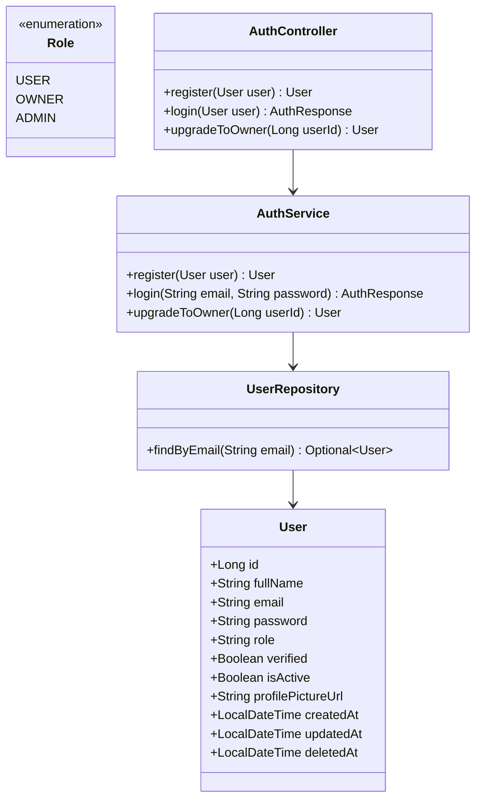

### 3.1.5 Sequence Diagram (Implementation APIs)
* **Base URL**: `/api/auth`
* **POST `/register`**: Creates new user with standard `USER` role.
* **POST `/login`**: Authenticates credentials and returns `AuthResponse` containing the JWT token.
* **PUT `/upgrade-to-owner/{userId}`**: Promotes user role to `OWNER`.

---

## 3.2 System Feature 2: Property Management

### 3.2.1 Description and Priority
Enables landlords to create, update, and manage property listings with detailed descriptions and images.
* **Priority**: High

### 3.2.2 Stimulus/Response Sequences
* **Landlord submits property details**: System processes input, uploads files, saves coordinates, and saves property.

### 3.2.3 Functional Requirements
* **REQ-F-100**: Landlord creates property listing.
* **REQ-F-102**: Uploading of multiple images per property.
* **REQ-F-105**: Deleting property listings.

### 3.2.4 Use case diagram (Object Model/Data Flow Design)

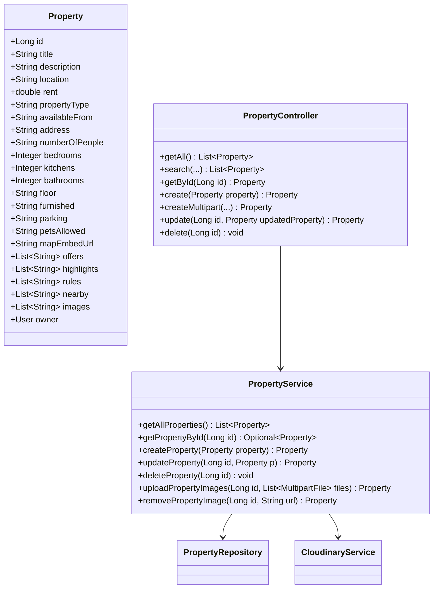

### 3.2.5 Sequence Diagram (Implementation APIs)
* **Base URL**: `/api/properties`
* **GET `/`**: Lists all properties.
* **GET `/search`**: Queries properties based on filters (rent, type, location).
* **POST `/`**: Handles JSON payload or Multipart Form Data for uploading properties with images.
* **PUT `/{id}`**: Modifies listing specifications.
* **DELETE `/{id}`**: Removes property.

---

## 3.3 System Feature 3: Roommate Finder

### 3.3.1 Description and Priority
Enables tenants/students to post search listings for compatible roommates.
* **Priority**: High

### 3.3.2 Stimulus/Response Sequences
* **User saves roommate details**: System validates interests, preferred locations, and budget, and publishes roommate post.

### 3.3.3 Functional Requirements
* **REQ-F-200**: Tenant roommate profile creation.
* **REQ-F-202**: Browsing roommate postings.
* **REQ-F-209**: Updating roommate specifications.

### 3.3.4 Use case diagram (Object Model/Data Flow Design)

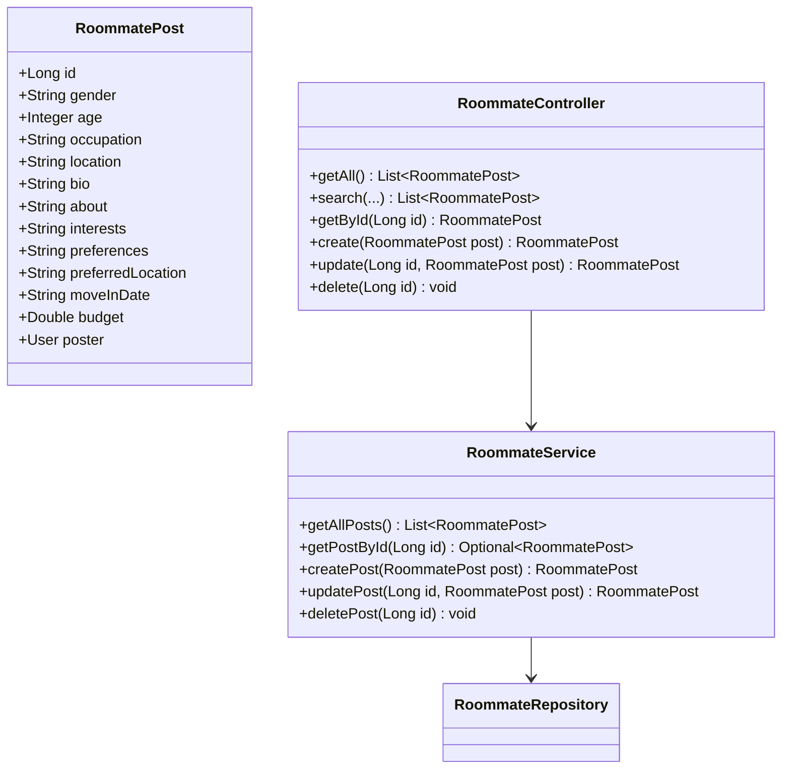

### 3.3.5 Sequence Diagram (Implementation APIs)
* **Base URL**: `/api/roommates`
* **GET `/`**: List all posts.
* **GET `/search`**: Queries roommate posts based on preferences.
* **POST `/`**: Creates post (Requires authentication context).
* **PUT `/{id}`**: Updates post.
* **DELETE `/{id}`**: Deletes post.

---

## 3.4 System Feature 4: Reviews and Ratings

### 3.4.1 Description and Priority
Allows authenticated users to rate and review listings.
* **Priority**: Medium

### 3.4.2 Stimulus/Response Sequences
* **User submits star rating**: System computes average rating and appends feedback details.

### 3.4.3 Functional Requirements
* **REQ-F-300**: Review submission.
* **REQ-F-301**: Rating scale validation (1-5 range).
* **REQ-F-304**: Review deletion.

### 3.4.4 Use case diagram (Object Model/Data Flow Design)

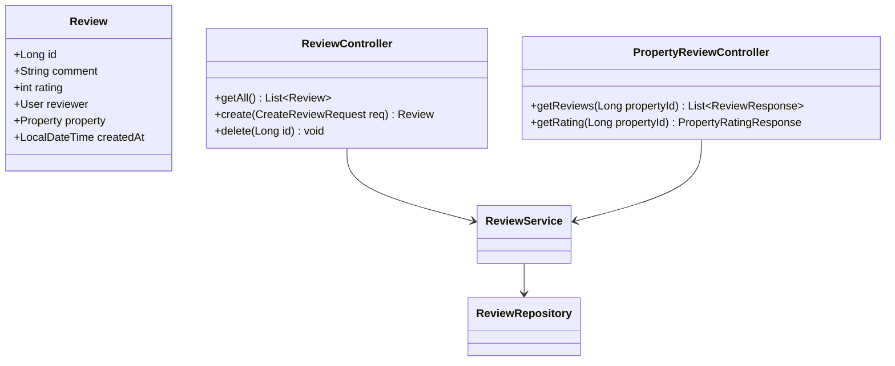

### 3.4.5 Sequence Diagram (Implementation APIs)
* **POST `/api/reviews`**: Creates review.
* **GET `/api/properties/{propertyId}/reviews`**: Lists property reviews.
* **GET `/api/properties/{propertyId}/rating`**: Computes average star rating.

---

## 3.5 System Feature 5: AI-Powered Recommendations

### 3.5.1 Description and Priority
Uses the Gemini API to analyze user preferences and suggest compatible listings.
* **Priority**: High

### 3.5.2 Stimulus/Response Sequences
* **User requests matches**: System scans properties and roommate listings, compiles prompt parameters, invokes Gemini, and returns top matches.

### 3.5.3 Functional Requirements
* Analyzes preferences and budgets.
* Invokes Gemini API.
* Returns JSON match explanations.

### 3.5.4 Use case diagram (Object Model/Data Flow Design)

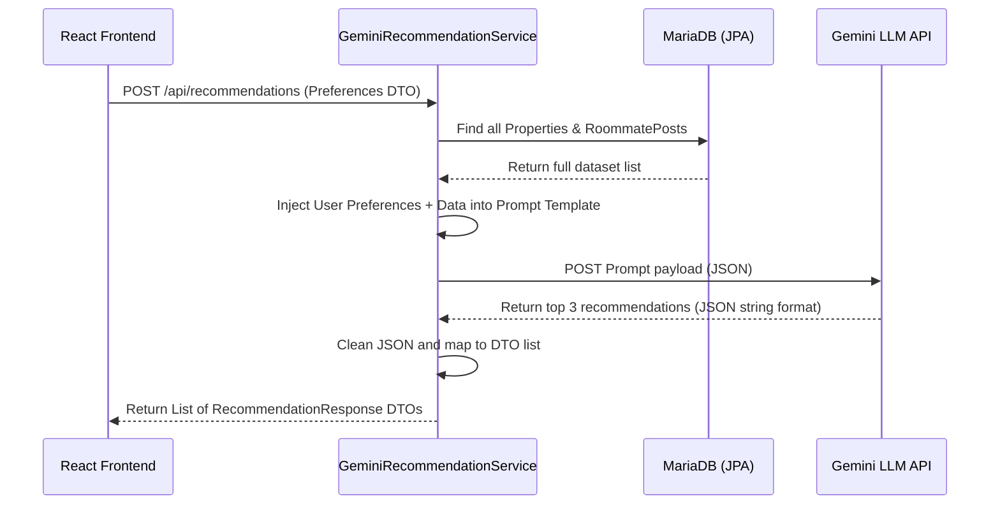

### 3.5.5 Sequence Diagram (Implementation APIs)
* **POST `/api/recommendations`**:
  * **Input**: `{ preferences: String, maxBudget: Double, preferredLocation: String, propertyType: String }`.
  * **Output**: `List<RecommendationResponse>` containing matches and explanation.

---

## 3.6 System Feature 6: Global Search (Elasticsearch)

### 3.6.1 Description and Priority
Enables concurrent fuzzy searching over roommate profiles and properties.
* **Priority**: High

### 3.6.2 Stimulus/Response Sequences
* **User inputs query**: Service queries search repositories and returns grouped findings.

### 3.6.3 Functional Requirements
* Low latency searches using Elasticsearch indices.
* Graceful fallback to database in-memory filtering.

### 3.6.4 Use case diagram (Object Model/Data Flow Design)

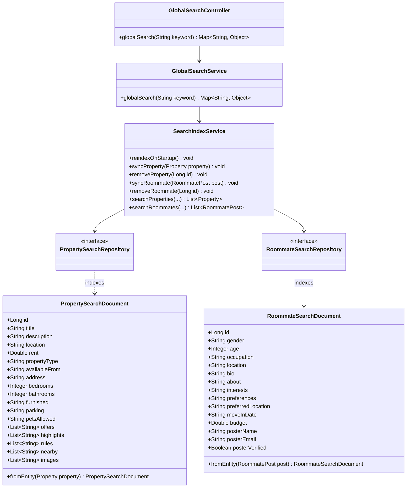

### 3.6.5 Sequence Diagram (Implementation APIs)

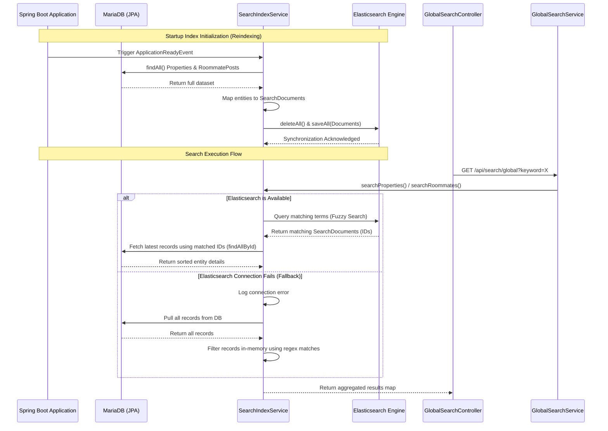
* **GET `/api/search/global?keyword={keyword}`**: Searches across `properties` and `roommates` indices.

---

## 3.7 System Feature 7: Real-time Chat / Messaging

### 3.7.1 Description and Priority
Enables instant user-to-user communication between property seekers, landlords, and roommates using standard WebSocket message brokers.
* **Priority**: High

### 3.7.2 Stimulus/Response Sequences
* **User opens chat dialogue**: Client establishes a socket handshake, retrieves message logs, and establishes subscriptions.
* **User inputs text & submits**: System publishes the payload directly to the user-recipient broker queue and writes the chat record to MariaDB.

### 3.7.3 Functional Requirements
* **REQ-F-400**: Establish dual WebSocket protocols (`ws://` and `wss://`) at endpoint `/ws`.
* **REQ-F-401**: Listen to user-recipient queue prefixes `/user/{userId}/queue/messages`.
* **REQ-F-402**: Store messages to ensure persistence across sessions.

### 3.7.4 Use case diagram (Object Model/Data Flow Design)

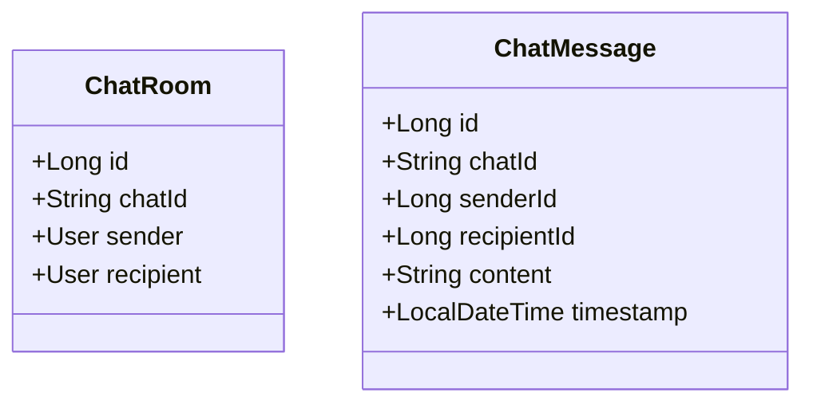

### 3.7.5 Sequence Diagram (Implementation APIs)
* **WebSocket Port**: `/ws` (Stomp connection endpoint).
* **GET `/api/chat/rooms/{senderId}/{recipientId}`**:
  * **Description**: Returns the unique `chatId` link for a specific conversation pair, establishing records if missing.
* **GET `/api/chat/rooms/{userId}`**:
  * **Description**: Lists all active conversation rooms for the given user.
* **GET `/api/chat/messages/{roomId}`**:
  * **Description**: Fetches the chat message history for the active conversation window.

---

## 3.8 System Feature 8: Notification System

### 3.8.1 Description and Priority
Pushes alerts to users when relevant activity occurs (such as receiving new chat messages or property listing modifications).
* **Priority**: Medium

### 3.8.2 Stimulus/Response Sequences
* **Listing updated or chat received**: Backend initiates a database logging insert and sends a push notification payload to the active user UI session.

### 3.8.3 Functional Requirements
* **REQ-F-500**: Send alert badges to client layouts upon target event triggers.
* **REQ-F-502**: Expose flags for marking alert logs as read.

### 3.8.4 Use case diagram (Object Model/Data Flow Design)

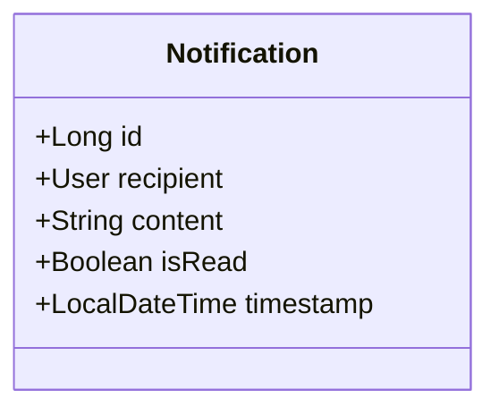

### 3.8.5 Sequence Diagram (Implementation APIs)
* **GET `/api/notifications`**:
  * **Description**: Pulls unread alert logs for the active user context.
* **PUT `/api/notifications/{id}/read`**:
  * **Description**: Flags the target notification log as read.

---

## 3.9 Database Design

### 3.9.1 Entity Relationship Diagram

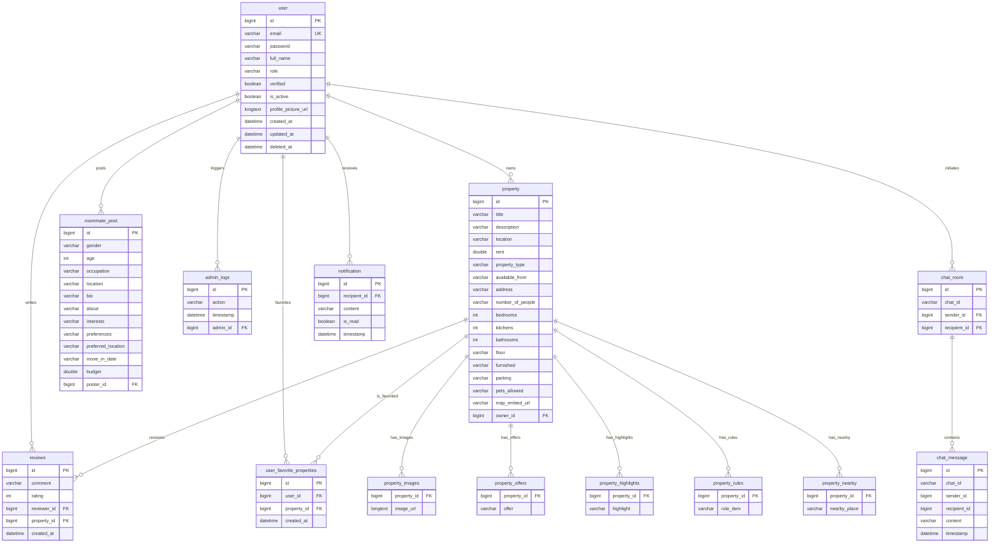

### 3.9.2 Database Schemas
Tables are mapped by Hibernate using relational database schemas. Foreign key constraints are enforced on deletes (e.g. cascading favorite property deletes).

---


# 4. Other Nonfunctional Requirements

### 4.1 Performance Requirements
* **REQ-NF-001**: API requests process and respond within 3 seconds under normal workloads.
* **REQ-NF-002**: Scalable capacity supporting 100 concurrent requests.
* **REQ-NF-004**: CDN image uploads complete in under 5 seconds.

### 4.2 Safety Requirements
All user entries are validated (size caps, formats) to avoid payload injection risks.

### 4.3 Security Requirements
* **JWT Filters**: Custom filter intercepts incoming calls, validating keys.
* **Hashing**: BCrypt encoding secures keys before saving to SQL tables.

### 4.4 Software Quality Attributes
* **Portability**: Handled via containerization running on standard JVM and Node platforms.
* **Maintainability**: Clear separation of controllers, services, repositories.

### 4.5 Business Rules
* Only verified accounts can upgrade to landlord status.
* Users can only edit or delete listings they own.

---

# 5. Other Requirements

### 5.1 Online User Documentation and Help System Requirements
User-facing alert modules and validation helper logs are coded into frontend layouts.

### 5.2 Purchased Components
External providers include **LeafletJS**, **Cloudinary API**, and **Google Gemini API**.

### 5.3 Interfaces

#### 5.3.1 User Interfaces
Graphical pages (Vite/React and Flutter) communicating via REST.

#### 5.3.2 Hardware Interfaces
Standard cloud VM resources (AWS EC2).

#### 5.3.3 Software Interfaces
MariaDB driver, Elasticsearch Client, Java OpenJDK 17.

#### 5.3.4 Communications Interfaces
HTTP/HTTPS JSON and Multipart Form Data.

### 5.4 Licensing Requirements
Platform software is licensed under academic open-source guidelines.

### 5.5 Legal, Copyright and Other Notices
Contains appropriate copyright notices for the Department of Computer Engineering, University of Ruhuna.

### 5.6 Applicable Standards
Complies with OWASP Top 10 recommendations and standard REST API standards.

---

# 6. System Architecture

### 6.1 Functional Architecture

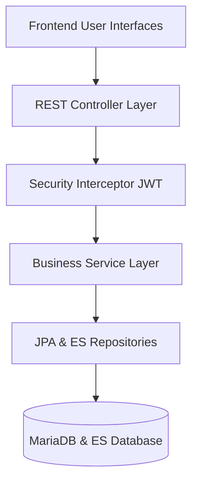

### 6.2 Logical Architecture
The application is structured as a clear **Three-Tier Logical Layer** mapping frontend views through to the backend business services and relational entities.

```mermaid
graph TD
    %% Frontend Pages
    subgraph Frontend Pages (React / Vite)
        HomePage[Home.jsx]
        AddPropPage[AddProperty.jsx]
        PropViewPage[PropertyView.jsx]
        PropsPage[Properties.jsx]
        RoomViewPage[RoommateView.jsx]
        ProfilePage[ProfilePage.jsx]
        SignUpPage[SignUp.jsx]
        SignInPage[SignIn.jsx]
        SettingsPage[Settings.jsx]
    end

    %% Frontend API Client
    apiClient[apiClient / Services]

    %% Connection from Pages to API Client
    HomePage & AddPropPage & PropViewPage & PropsPage & RoomViewPage & ProfilePage & SignUpPage & SignInPage & SettingsPage -->|Call API| apiClient

    %% Backend Controllers
    subgraph Spring Boot Controllers
        AuthController[AuthController]
        PropertyController[PropertyController]
        RoommateController[RoommateController]
        UserController[UserController]
        ReviewController[ReviewController]
        AdminController[AdminController]
        RecommendController[RecommendationController]
        SearchController[GlobalSearchController]
    end

    %% Client communicating to Controllers
    apiClient -->|HTTP REST / JSON| AuthController & PropertyController & RoommateController & UserController & ReviewController & AdminController & RecommendController & SearchController

    %% Backend Services
    subgraph Spring Boot Services
        AuthService[AuthService]
        PropertyService[PropertyService]
        RoommateService[RoommateService]
        UserService[UserService]
        ReviewService[ReviewService]
        AdminLogService[AdminLogService]
        CloudinaryService[CloudinaryService]
        GeminiService[GeminiRecommendationService]
        SearchService[SearchIndexService]
    end

    %% Controllers calling Services
    AuthController --> AuthService
    PropertyController --> PropertyService
    RoommateController --> RoommateService
    UserController --> UserService
    ReviewController --> ReviewService
    AdminController --> AdminLogService
    RecommendController --> GeminiService
    SearchController --> SearchService

    %% Service to Service relationships
    PropertyService --> CloudinaryService
    UserService --> CloudinaryService

    %% Repositories
    subgraph Repositories (JPA & Elasticsearch)
        UserRepository[UserRepository]
        PropertyRepository[PropertyRepository]
        RoommateRepository[RoommateRepository]
        ReviewRepository[ReviewRepository]
        AdminLogRepository[AdminLogRepository]
        FavPropertyRepository[UserFavoritePropertyRepository]
        PropSearchRepo[PropertySearchRepository]
        RoommateSearchRepo[RoommateSearchRepository]
    end

    %% Service to Repositories
    AuthService --> UserRepository
    PropertyService --> PropertyRepository
    RoommateService --> RoommateRepository
    UserService --> UserRepository
    ReviewService --> ReviewRepository
    AdminLogService --> AdminLogRepository
    GeminiService --> PropertyRepository & RoommateRepository
    SearchService --> PropSearchRepo & RoommateSearchRepo

    %% Entities
    subgraph Hibernate Entities
        EUser[(User Entity)]
        EProperty[(Property Entity)]
        ERoommate[(RoommatePost Entity)]
        EReview[(Review Entity)]
        EAdminLog[(AdminLog Entity)]
        EFavProperty[(UserFavoriteProperty Entity)]
    end

    %% Repository to Entity mappings
    UserRepository --> EUser
    PropertyRepository --> EProperty
    RoommateRepository --> ERoommate
    ReviewRepository --> EReview
    AdminLogRepository --> EAdminLog
    FavPropertyRepository --> EFavProperty

    %% Data Transfer Objects
    subgraph DTO Packages
        AuthResponse[AuthResponse]
        UserProfileResponse[UserProfileResponse]
        UserProfileUpdate[UserProfileUpdateRequest]
        ChangePassword[ChangePasswordRequest]
        RecommendReq[RecommendationRequest]
        RecommendResp[RecommendationResponse]
        ReviewResp[ReviewResponse]
        RatingResp[PropertyRatingResponse]
    end
```

### 6.3 Component Architecture
The backend is structured into clear sub-packages under `com.bodimkarayo.backend`, establishing clean separation of concerns:
* **Controller Layer (`.controller`)**: Handlers mapping REST requests, checking permissions, and initiating DTO validation.
* **Service Layer (`.service`)**: Core business rule validations, database transactions, and third-party integrations (Cloudinary, Google Gemini).
* **Repository Layer (`.repository`)**: Interfaces extending `JpaRepository` for relational database commands.
* **Search Module (`.search`)**: Search document schema classes and Elasticsearch repository handlers.
* **Data Transfer Objects (`.dto`)**: Serialization structures optimizing data transfers.
* **Model Layer (`.model`)**: Mapped Hibernate objects defining DB tables and fields.

### 6.4 Physical Architecture (Deployment Scheme)
The platform deployment is automated via a GitOps CI/CD pipeline using **GitHub**, **Jenkins**, **Terraform**, **Docker**, and **AWS EC2**. Nginx serves as the reverse proxy container to map ports.

```mermaid
graph TD
    %% Github to Jenkins
    GitHub[GitHub Repo] -->|Webhook push event| Jenkins[Jenkins CI/CD Server]
    
    %% Infrastructure
    subgraph Infrastructure (Terraform)
        TF[Terraform Scripts] -->|Auto-provision| EC2[AWS EC2 Host]
    end

    %% Build pipeline
    subgraph Jenkins Build Stages
        Jenkins -->|1. Build & Test| Maven[Maven & NPM compile]
        Jenkins -->|2. Dockerize| Image[Build Docker Images]
        Jenkins -->|3. Registry| Registry[Docker Hub / ECR]
    end

    %% Deployment
    Registry -->|4. Pull & run compose| EC2

    %% Network Routing inside EC2
    subgraph AWS EC2 Host (Docker Network)
        Proxy[Nginx Proxy Container] -->|Port 5173| Web[React Frontend]
        Proxy -->|Port 5174| Admin[React Admin]
        Proxy -->|Port 8080| Backend[Spring Boot API]
        Backend -->|Port 3306| DB[MariaDB SQL]
        Backend -->|Port 9200| ES[Elasticsearch]
    end
    
    EC2 --> Proxy
```

* **Infrastructure Provisioning**: Managed by Terraform scripts (`main.tf`, `variables.tf`) ensuring standardized cloud provisioning.
* **Continuous Integration**: Jenkins listens to GitHub commits, compiles sources, and publishes built Docker images to the registry.
* **Continuous Deployment**: Jenkins uses SSH to connect to the AWS EC2 instance, downloads updated Docker images, and calls `docker compose up -d` to upgrade the containers.

---

# Appendices

### Appendix A: Glossary
* Refer to Glossary of Terms in introductory headers.

### Appendix B: Analysis Models
* Database Entity Relation Diagram (Sec 3.9.1)
* System Deployment Diagram & Jenkins Workflow (Sec 6.4)
* Infrastructure Provisioning Declarations (Terraform `main.tf` and Jenkinsfile)

### Appendix C: To Be Determined List (TBD)
1. **Online Payments Gateway Integration**:
   * **Details**: Future integration of local Sri Lankan payment processing (e.g. PayHere) to automate landlord subscription billing.
2. **Dynamic Distance Calculations**:
   * **Details**: Integrating distance matrix calculation algorithms using external map API endpoints to show property proximity to universities.


